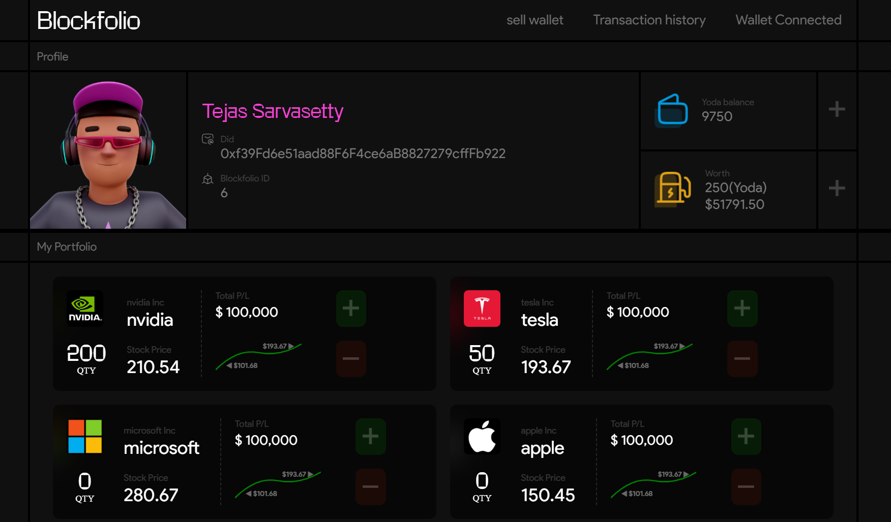

# Blockfolio

Manage, track, and trade your stock portfolio as NFTs.



## Prerequisites

Ensure you have the following installed:
- metamask browser extension (ensure its connected to the local harthat network and a hardhat account is added , instructions below)
- [Node.js](https://nodejs.org/) (LTS version recommended)
- [Hardhat](https://hardhat.org/)
- [http-server](https://www.npmjs.com/package/http-server)
- python 3.10 +
- mongo db
- Linux Terminal (tested on debian)

## Steps to Run the Project

### 1. Clone the Repository
```sh
git clone https://github.com/yourusername/blockfolio.git
cd blockfolio
```

### 2. Run the Hardhat Node

Open a terminal and execute:
```sh
cd blockfoliodapp
npx hardhat node
```

This will start a local Hardhat blockchain at `http://127.0.0.1:8545/`.

### 3. Deploy the Smart Contracts

Open another terminal and execute:
```sh
cd blockfoliodapp
npx hardhat run deployscript/deploy.js --network localhost
```

This will deploy the smart contracts to the local Hardhat blockchain.

### 4. Run the Frontend

Open another terminal and execute:
```sh
cd Website
npx http-server
```

This will start a local web server for the frontend.

## Database Setup Required

Creates the `blockfolio` database and initializes the core collections used by the application.

```sh
use blockfolio
db.createCollection("listings")
db.createCollection("transactions")
db.createCollection("users")
```

## APIs (Required)

Starts the backend API server for the Blockfolio application.

```sh
cd blockfoliobackend/
pip install -r requirements.txt
uvicorn api:app --reload

```

# (Prereq)  Adding Hardhat Network to MetaMask

This guide will help you add the Hardhat local blockchain as a network in MetaMask and import an account from Hardhat.

## Step 1: Start Hardhat Node

Before adding the network, you need to start the Hardhat node. Open a terminal and run:
```sh
cd blockfoliodapp
npx hardhat node
```
This will start a local blockchain at `http://127.0.0.1:8545/` and generate several test accounts with private keys.

## Add Hardhat Network to MetaMask

1. Open **MetaMask** in your browser.
2. Click on your profile icon in the top-right corner and go to **Settings**.
3. Navigate to **Networks** and click **Add Network**.
4. Select **Add a Network Manually**.
5. Fill in the following details:
   - **Network Name:** Hardhat Localhost
   - **New RPC URL:** `http://127.0.0.1:8545/`
   - **Chain ID:** `31337`
   - **Currency Symbol:** ETH
   - **Block Explorer URL:** *(Leave empty)*
6. Click **Save**. The Hardhat network is now added to MetaMask.

### Step 2: Import a Hardhat Account into MetaMask

When you run `npx hardhat node`, it displays a list of test accounts along with their private keys. To import one:

1. Copy a private key from the Hardhat node output.
2. Open **MetaMask** and make sure you're on the **Hardhat Localhost** network.
3. Click on your account icon and select **Import Account**.
4. Paste the copied private key and click **Import**.
5. The account will now be available in MetaMask with preloaded test ETH.


